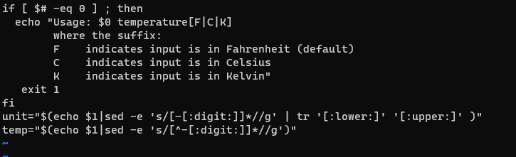
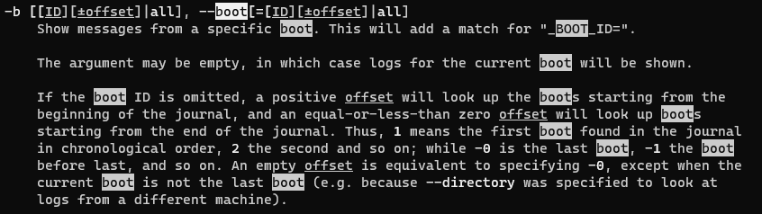
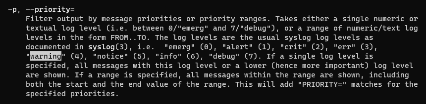
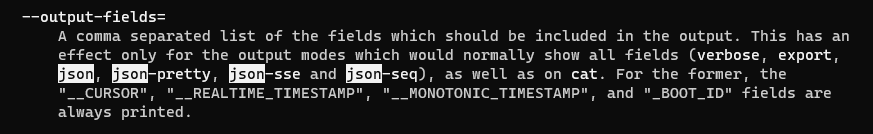
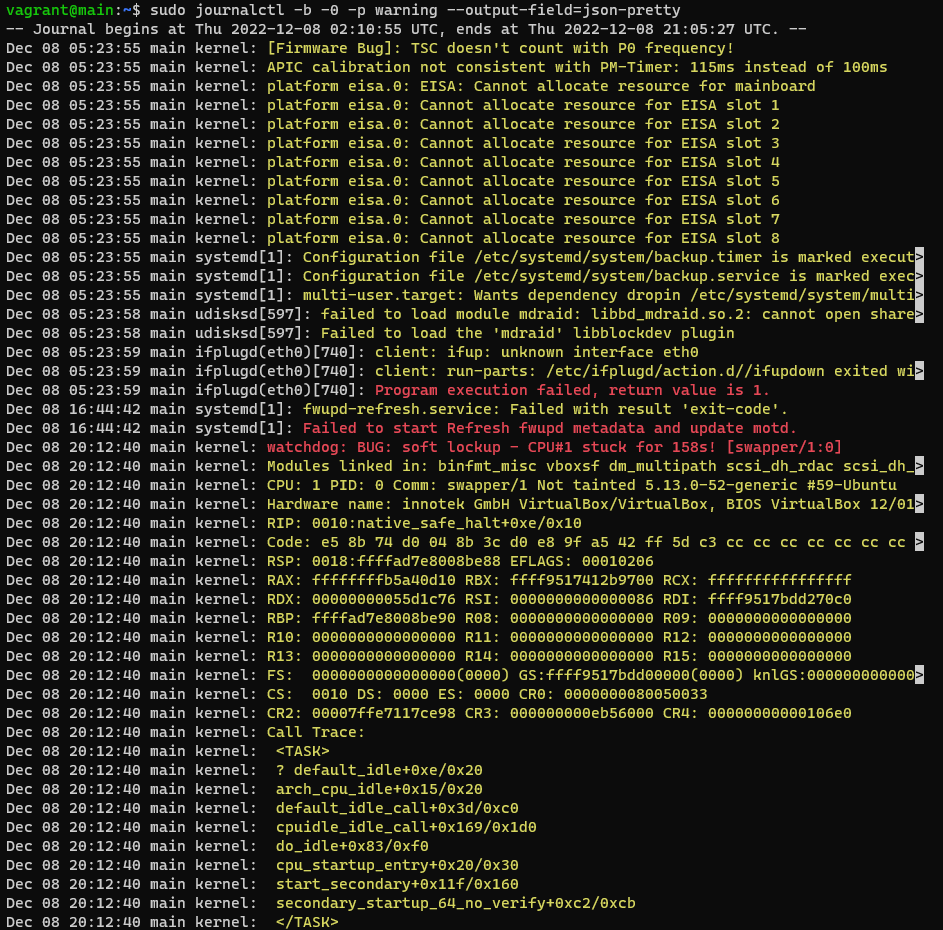

# Exam_2420

## Establish Server Connection

### Author

+ **Nai Yen Lin**
  + *A01320713*


## Part 1

The command to update most of the software on your Ubuntu OS

```bash
sudo apt update
sudo apt upgrade
```


## Part 2

Using replace function in Vim

```bash
:s/1/0 # to replace first 1 to 0 in the script
:%s/V/C/g # to replace all upper letter V to upper letter C
:%s/eco/echo/g # to replace all "eco" to "echo" in this script
```

Then press "I" on the keyboard, goes into "insert mode".
Using "down arrow" to move the cursor down, delete "numb" and second last two row.
Replace it with ":digit:" (it gives me error when i try to edit with replace command) 

Screenshots of script are provided below.



## Step 3

Get to the manual page of "journalctl" first.

```bash
man journalctl
/boot #search for option to print log of the current boot (lastest one)
/warning #search for option to prioritize the warning
/json #search for format to output pretty json

sudo journalctl -b -0 -p warning --output-field=json-pretty #The command I used to access
```

Screenshot of boot part.


Screenshot of warning part. 


Screenshot of json part. 


Screenshot of output part. 



## Step 4

Code snippet of the bash file

```bash
#!/bin/bash

sudo rm /etc/motd

sudo touch /etc/motd

sudo chmod a+rwx /etc/motd

echo "Regular users on the system are:" > /etc/motd

grep -h [1-4][0-9][0-9][0-9] /etc/passwd | awk -F ":" '{ print $1, $3, $6 }' > /etc/motd

echo "Users currently logged in are:" >/etc/motd

who > /etc/motd

echo "Data stored into /etc/motd"

exit 0
```


## Step 5

The contents in service file.

```bash
[Unit]
Description=find users on the system

[Service]
Type=oneshot
ExecStart=/home/vagrant/find_users

[Install]
WantedBy=multi-user.target
```

